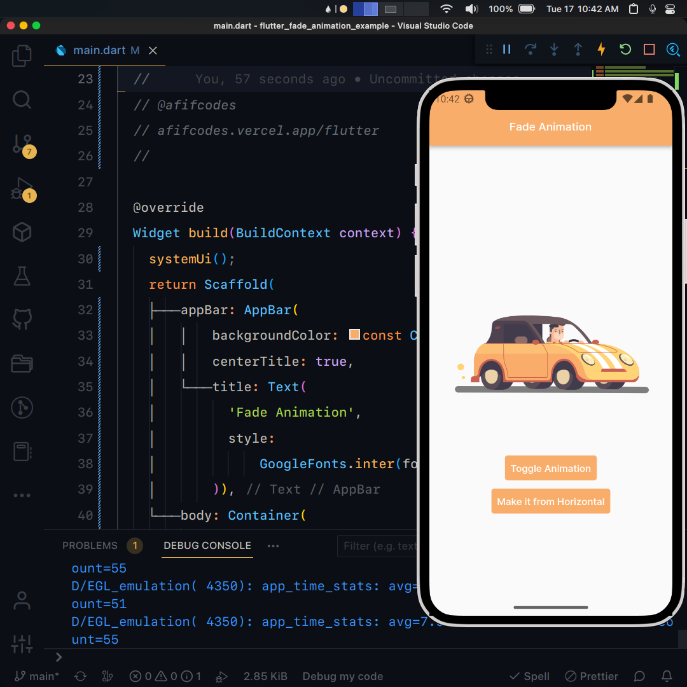

## Flutter UI - Fade Animation

```dart
void main() => runApp(const MaterialApp(
      debugShowCheckedModeBanner: false,
      home: MyApp(),
    ));
```

## Development Setup
```
git clone https://github.com/afifcodes/flutter-fade-animation-example.git
cd flutter-fade-animation-example
flutter pub get
flutter run
```

## Screenshots


## Links

* [Website](https://afifcodes.vercel.app/flutter)
* [Youtube channel](https://youtube.com/afifcodes)
* [Instagram](https://instagram.com/afifcodes)